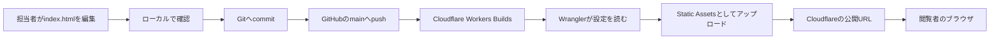

# Cloudflare公開・運用ガイド

この文書は、`business-registration-guide`をCloudflareで公開・更新する担当者向けのガイドです。

CloudflareやGitHubを初めて使う人でも作業できるように、「なぜその設定が必要なのか」「どのコマンドを実行するのか」「失敗したときに何を確認するのか」を、このリポジトリの実際の構成に沿って説明します。

> このサイトでは **Cloudflare Workers Static Assets** を使用します。Cloudflare Pagesの手順ではありません。Cloudflareの画面に「Workers & Pages」と表示されても、選択する対象はWorkerです。

## 目次

1. [最初に理解すること](#1-最初に理解すること)
2. [このサイトが公開される仕組み](#2-このサイトが公開される仕組み)
3. [用語集](#3-用語集)
4. [リポジトリ内の設定ファイル](#4-リポジトリ内の設定ファイル)
5. [初回準備](#5-初回準備)
6. [CloudflareとGitHubの連携設定](#6-cloudflareとgithubの連携設定)
7. [普段の更新と公開](#7-普段の更新と公開)
8. [公開前のプレビュー](#8-公開前のプレビュー)
9. [ローカルでサイトを確認する](#9-ローカルでサイトを確認する)
10. [手動でデプロイする](#10-手動でデプロイする)
11. [公開後の確認](#11-公開後の確認)
12. [問題が起きたときの確認方法](#12-問題が起きたときの確認方法)
13. [以前のバージョンへ戻す](#13-以前のバージョンへ戻す)
14. [独自ドメインを設定する](#14-独自ドメインを設定する)
15. [安全に運用するための注意事項](#15-安全に運用するための注意事項)
16. [コマンド早見表](#16-コマンド早見表)
17. [公式ドキュメント](#17-公式ドキュメント)

## 1. 最初に理解すること

このサイトは、主に1つのHTMLファイルで構成された静的サイトです。

- 画面の内容: `index.html`
- ソースコードの保管場所: GitHub
- 公開先: Cloudflare Workers
- ファイルの配信機能: Cloudflare Workers Static Assets
- Cloudflareを操作するCLI: Wrangler
- 本番として扱うGitブランチ: `main`
- Cloudflare上のWorker名: `business-registration-guide`

一般的なWebアプリとは異なり、ReactやVueなどをJavaScriptへ変換する「ビルド処理」はありません。`index.html`をそのままCloudflareへアップロードして公開します。

### この構成で行わないこと

- サーバー上でNode.jsアプリを常時起動する
- データベースへ接続する
- `dist`や`build`ディレクトリを生成する
- APIサーバーを動かす
- Cloudflare Pagesとしてデプロイする

そのため、更新作業の基本は「`index.html`を修正してGitHubへpushする」です。GitHubとCloudflareの連携が正しく設定されていれば、そのpushをきっかけにCloudflareが自動公開します。

## 2. このサイトが公開される仕組み



公開までの流れは次のとおりです。

1. 担当者が手元のPCで`index.html`を編集します。
2. ローカルサーバーで表示を確認します。
3. Gitへ変更をcommitします。
4. GitHubの`main`ブランチへpushします。
5. Cloudflareがpushを検知し、GitHubからソースコードを取得します。
6. Cloudflare上で`npx wrangler deploy`が実行されます。
7. Wranglerが`wrangler.jsonc`を読み、公開対象のファイルをアップロードします。
8. 新しいバージョンが本番へデプロイされ、公開URLの内容が更新されます。

### 「バージョン」と「デプロイ」の違い

Cloudflareでは、アップロードされたコードと静的ファイルのまとまりを**バージョン**として管理します。

**デプロイ**は、どのバージョンへ実際のアクセスを流すかを決める操作です。

- `wrangler versions upload`: 新しいバージョンをアップロードしますが、本番は切り替えません。
- `wrangler deploy`: 新しいバージョンをアップロードし、そのバージョンを本番として公開します。

「アップロードに成功したのに本番サイトが変わらない」という場合は、`versions upload`だけを実行していないか確認してください。

## 3. 用語集

| 用語 | このガイドでの意味 |
| --- | --- |
| Cloudflare | サイトのファイルを保存し、インターネット上へ高速に配信するサービスです。 |
| Worker | Cloudflare上で動く公開単位です。このサイトでは主に静的ファイルの配信に使います。 |
| Static Assets | HTML、CSS、JavaScript、画像などの静的ファイルを配信するWorkersの機能です。 |
| Wrangler | Cloudflare Workersをローカルから確認・アップロード・管理する公式CLIです。 |
| CLI | 画面上のボタンではなく、ターミナルへコマンドを入力して操作するツールです。 |
| Git | ファイルの変更履歴を管理する仕組みです。 |
| GitHub | Gitで管理したリポジトリをインターネット上で共有するサービスです。 |
| リポジトリ | サイトのファイルと変更履歴をまとめた保管場所です。 |
| ブランチ | 同じリポジトリ内で変更を分けて管理する仕組みです。`main`を本番用に使います。 |
| commit | 変更内容を説明付きでGitの履歴へ記録する操作です。 |
| push | ローカルのcommitをGitHubへ送信する操作です。 |
| build | 公開前にファイルを生成・変換する処理です。このサイトには通常のビルド処理はありません。 |
| version | Cloudflareへアップロードされたコード・静的ファイル・設定のまとまりです。 |
| deployment | 特定のバージョンを実際のアクセス先として公開することです。 |
| production | 利用者が見る本番環境です。このリポジトリでは`main`を本番ブランチにします。 |
| preview | 本番へ切り替える前に、別URLなどで変更内容を確認することです。 |
| CDN | 世界各地のCloudflare拠点からファイルを配信し、表示を高速化する仕組みです。 |

## 4. リポジトリ内の設定ファイル

### `index.html`

サイト本体です。文章、レイアウト、スタイル、画面上の動作がこのファイルに含まれています。

ブラウザで公開URLの`/`へアクセスすると、Cloudflareがこの`index.html`を返します。

### `wrangler.jsonc`

WranglerとCloudflare Workersの設定ファイルです。

```jsonc
{
  "$schema": "./node_modules/wrangler/config-schema.json",
  "name": "business-registration-guide",
  "compatibility_date": "2026-07-14",
  "assets": {
    "directory": "."
  }
}
```

各項目の意味は次のとおりです。

| 設定 | 意味 |
| --- | --- |
| `$schema` | エディタが設定内容を検査・補完するためのスキーマです。Cloudflareの動作そのものを指定する値ではありません。 |
| `name` | Cloudflare上のWorker名です。管理画面のWorker名と一致させます。 |
| `compatibility_date` | Workersランタイムの互換性を固定する日付です。Cloudflareの新しい挙動で突然壊れることを避けます。 |
| `assets.directory` | アップロード対象の基準ディレクトリです。`.`はリポジトリのルートを表します。 |

このサイトにはWorker用のJavaScriptやTypeScriptがないため、`main`設定はありません。`assets.directory`だけで静的ファイルを公開できます。

### `package.json`

npmで使用するコマンドと、Wranglerのバージョンを管理します。

```json
{
  "name": "business-registration-guide",
  "private": true,
  "scripts": {
    "deploy": "wrangler deploy",
    "deploy:preview": "wrangler versions upload",
    "check": "wrangler deploy --dry-run"
  },
  "devDependencies": {
    "wrangler": "4.110.0"
  }
}
```

| コマンド | 実際の処理 | 用途 |
| --- | --- | --- |
| `npm run deploy` | `wrangler deploy` | Cloudflareへ手動で本番デプロイします。 |
| `npm run deploy:preview` | `wrangler versions upload` | 本番を切り替えず、新しいバージョンをアップロードします。 |
| `npm run check` | `wrangler deploy --dry-run` | 実際には公開せず、デプロイ可能か検査します。 |

`private: true`は、このリポジトリを誤ってnpmパッケージとして公開しないための設定です。

Wranglerのバージョンを固定しているため、PCやCloudflare上で異なるWranglerが使われる可能性を減らせます。

### `package-lock.json`

Wranglerと関連パッケージの正確なバージョンを記録します。通常は直接編集しません。

`npm ci`を実行すると、このファイルに記録されたバージョンどおりに依存パッケージがインストールされます。

### `.assetsignore`

Cloudflareへ静的ファイルとしてアップロードしないものを指定します。

```text
.git/
.gitignore
.assetsignore
.wrangler/
node_modules/
package.json
package-lock.json
wrangler.jsonc
modify.md
CLOUDFLARE_DEPLOYMENT_GUIDE.md
```

`assets.directory`が`.`になっているため、何も除外しなければリポジトリ直下の管理用ファイルまで公開対象になり得ます。`.assetsignore`によって、Gitの履歴、依存パッケージ、設定ファイル、この運用ガイドなどを配信対象から外しています。

新しい管理用ファイルを追加した場合は、Webサイトから直接配信する必要があるか確認してください。不要であれば`.assetsignore`へ追加します。

### `.gitignore`

Gitの変更履歴へ含めないファイルを指定します。

```text
node_modules/
.wrangler/
```

- `node_modules/`: `npm ci`で再生成できるため、GitHubへpushしません。
- `.wrangler/`: Wranglerがローカルで生成する一時ファイルのため、GitHubへpushしません。

`.gitignore`はGit用、`.assetsignore`はCloudflareへのアップロード用です。目的が異なります。

## 5. 初回準備

### 必要なもの

作業するPCに次のものが必要です。

- Git
- Node.jsのLTS版とnpm
- このGitHubリポジトリへのアクセス権限
- Cloudflareアカウント
- 対象Workerを編集・デプロイできるCloudflare権限

### リポジトリを取得する

まだ手元にリポジトリがない場合だけ実行します。

```bash
git clone https://github.com/Mak-GIBA/business-registration-guide.git
cd business-registration-guide
```

すでにこのディレクトリがある場合は、cloneし直す必要はありません。

### Node.jsとnpmを確認する

```bash
node --version
npm --version
```

両方のバージョンが表示されれば、基本的な準備はできています。`command not found`と表示された場合は、Node.jsのLTS版をインストールしてください。npmは通常Node.jsと一緒にインストールされます。

### 依存パッケージをインストールする

リポジトリのルートで実行します。

```bash
npm ci
```

`npm install`でもインストールできますが、運用時は`package-lock.json`どおりに再現できる`npm ci`を推奨します。

### Wranglerを確認する

```bash
npx wrangler --version
```

このリポジトリでは`4.110.0`が表示される想定です。

### Cloudflareへのログイン状態を確認する

ローカルPCから手動デプロイする場合に必要です。

```bash
npx wrangler whoami
```

ログインしていない場合は次を実行します。

```bash
npx wrangler login
```

ブラウザが開くので、正しいCloudflareアカウントでログインし、Wranglerからのアクセスを許可します。GitHub連携による自動デプロイだけを使う場合、日常作業でローカルログインは必須ではありません。

## 6. CloudflareとGitHubの連携設定

この設定は通常、最初の1回だけ行います。すでに`main`へのpushで自動デプロイできている場合は、設定確認として利用してください。

Cloudflare管理画面の表記は更新される場合がありますが、設定する値は次のとおりです。

| 項目 | 設定値 |
| --- | --- |
| GitHubリポジトリ | `Mak-GIBA/business-registration-guide` |
| Worker名 | `business-registration-guide` |
| Production branch | `main` |
| Root directory | `/`（リポジトリのルート） |
| Build command | 空欄 |
| Deploy command | `npx wrangler deploy` |
| Non-production branch deploy command | `npx wrangler versions upload` |

### 設定手順

1. [Cloudflare Dashboard](https://dash.cloudflare.com/)へログインします。
2. 左側のメニューから **Workers & Pages** を開きます。
3. `business-registration-guide`を選択します。まだ存在しない場合はWorkerを新規作成します。
4. **Settings**、**Build**またはGit連携に関する項目を開きます。
5. GitHubアカウントを接続します。
6. リポジトリとして`Mak-GIBA/business-registration-guide`を選択します。
7. Production branchへ`main`を設定します。
8. Root directoryへリポジトリのルートを指定します。画面上で`/`または空欄がルートを表す場合があります。
9. Build commandは空欄にします。このサイトには変換・生成処理がないためです。
10. Deploy commandへ`npx wrangler deploy`を設定します。
11. 非本番ブランチ用のコマンドを設定できる場合は、`npx wrangler versions upload`を設定します。
12. 設定を保存します。
13. 最新のデプロイログを開き、エラーがないことを確認します。

### Worker名を一致させる理由

`wrangler.jsonc`の`name`は`business-registration-guide`です。Cloudflare上で別名のWorkerを選択すると、意図しない別サイトへデプロイしたり、新しいWorkerが作成されたりする可能性があります。

作業前に、Cloudflare管理画面で選択しているWorker名と`wrangler.jsonc`の`name`が同じことを確認してください。

## 7. 普段の更新と公開

日常的な変更では、次の順番で作業します。

### 1. 作業開始前に最新状態を取得する

```bash
git switch main
git fetch origin
git pull --rebase origin main
```

`git pull --rebase`は、GitHubにある他の人の変更を取り込み、自分の作業開始地点を最新にします。

### 2. サイトを編集する

主に`index.html`を編集します。

編集後は変更されたファイルを確認します。

```bash
git status
git diff
```

`git diff`では、削除するつもりのない文章や設定が消えていないか確認してください。

### 3. ローカルで表示を確認する

```bash
npx wrangler dev
```

表示されたローカルURLをブラウザで開きます。通常は次のようなURLです。

```text
http://localhost:8787
```

確認が終わったら、ターミナルで`Ctrl+C`を押して終了します。

### 4. Cloudflareへ送信できるか検査する

```bash
npm run check
```

これはdry runです。設定とアップロード対象を検査しますが、本番サイトは変更しません。

### 5. Gitへ記録する

```bash
git add index.html
git commit -m "更新内容を簡潔に説明"
```

複数ファイルを変更した場合は、必要なファイルだけを`git add`します。`git add .`を使う前に`git status`で対象を確認してください。

### 6. push直前にGitHubの最新変更を取り込む

```bash
git fetch origin
git rebase origin/main
```

競合がなければ、そのまま次へ進めます。競合が発生した場合は、[Gitのコンフリクトが発生した](#gitのコンフリクトが発生した)を確認してください。

### 7. GitHubへpushする

```bash
git push origin main
```

pushに成功すると、Cloudflareが自動デプロイを開始します。

### 8. Cloudflareで結果を確認する

1. Cloudflare Dashboardの **Workers & Pages** を開きます。
2. `business-registration-guide`を選択します。
3. BuildsまたはDeploymentsを開きます。
4. 最新のcommitに対応する処理が成功していることを確認します。
5. 公開URLを開き、変更内容を確認します。

## 8. 公開前のプレビュー

大きな変更は、`main`へ直接入れる前に作業ブランチで確認できます。

### 作業ブランチを作成する

```bash
git switch main
git pull --rebase origin main
git switch -c update/short-description
```

編集と確認が終わったらcommitしてpushします。

```bash
git add index.html
git commit -m "更新内容を簡潔に説明"
git push -u origin update/short-description
```

Cloudflareの非本番ブランチ用コマンドが`npx wrangler versions upload`に設定されていれば、新しいバージョンは作成されますが、本番トラフィックは自動では切り替わりません。

Cloudflareのビルド結果にプレビューURLが表示される場合は、そのURLで確認します。確認後、GitHub上で`main`へマージすると本番デプロイが実行されます。

### ローカルからプレビューバージョンをアップロードする

```bash
npm run deploy:preview
```

このコマンドにはCloudflareへのログインとデプロイ権限が必要です。本番を更新するコマンドではありません。

## 9. ローカルでサイトを確認する

### 自分のPCだけで確認する

```bash
npx wrangler dev
```

ブラウザで`http://localhost:8787`を開きます。

`index.html`を直接ダブルクリックして開く方法もありますが、公開環境とURLの扱いが異なる場合があります。Wrangler経由での確認を推奨します。

### 同じネットワーク内の別端末から確認する

スマートフォンなど、同じWi-Fiに接続した別端末から確認する場合は、Wranglerを外部接続可能なアドレスで起動します。

```bash
npx wrangler dev --ip 0.0.0.0
```

別のターミナルでPCのローカルIPアドレスを確認します。Linuxの例は次のとおりです。

```bash
hostname -I
```

PCのIPアドレスが`192.168.1.20`で、Wranglerのポートが`8787`なら、別端末で次を開きます。

```text
http://192.168.1.20:8787
```

接続できない場合は、両方の端末が同じネットワークにいるか、PCのファイアウォールが8787番ポートを遮断していないか確認してください。

> `--ip 0.0.0.0`は同じネットワークの端末から接続可能にします。信頼できない公共Wi-Fiでは使用しないでください。インターネット全体へ安全に公開するための機能ではありません。

### ポートを変更する

8787番ポートが使用中の場合は、別の番号を指定します。

```bash
npx wrangler dev --port 8788
```

この場合は`http://localhost:8788`を開きます。

## 10. 手動でデプロイする

GitHub連携が一時的に使用できない場合は、ローカルPCから手動デプロイできます。

```bash
npm ci
npx wrangler whoami
npm run check
npm run deploy
```

`npm run deploy`は本番を更新します。成功すると、デプロイされたWorker名やURLが表示されます。

### 手動デプロイを通常運用にしない理由

GitHub経由なら、「どのcommitが、いつ、誰によって公開されたか」をGitとCloudflareの両方で追跡しやすくなります。手動デプロイでは、commitしていないローカル変更を公開してしまう可能性があります。

通常は次の流れを使用してください。

```text
変更 → commit → GitHubへpush → Cloudflareが自動デプロイ
```

手動デプロイ前には、必ず次を確認します。

```bash
git status
git diff
```

## 11. 公開後の確認

### Cloudflareのデプロイ結果を確認する

1. Cloudflare Dashboardへログインします。
2. **Workers & Pages**を開きます。
3. `business-registration-guide`を選択します。
4. BuildsまたはDeploymentsを開きます。
5. 最新処理の状態がSuccessになっていることを確認します。
6. 対象のGit commitが意図したものか確認します。
7. ログ内で`wrangler deploy`が成功していることを確認します。

### ブラウザで確認する

最低限、次の内容を確認します。

- トップページが表示される
- 今回修正した文章が表示される
- レイアウトが崩れていない
- ページ内リンクや外部リンクが動作する
- PCとスマートフォン相当の幅で読める
- ブラウザの開発者ツールに重大なエラーがない

### `/`と404の挙動

公開URLの`/`へアクセスすると、Static Assetsが`index.html`を返します。

このサイトは、すべてのURLを`index.html`へ転送するSPA設定ではありません。存在しないファイルやパスへアクセスすると、通常は404になります。これは現在の構成では正常です。

### 古い内容が表示される場合

最初にCloudflareの最新デプロイが成功しているか確認します。その後、ブラウザで強制再読み込みします。

- Windows/Linux: `Ctrl+Shift+R`
- macOS: `Command+Shift+R`

シークレットウィンドウや別ブラウザで開くと、ブラウザキャッシュの影響かどうかを切り分けられます。

## 12. 問題が起きたときの確認方法

問題が発生したら、最初に次の4点を確認します。

```bash
git status
git branch --show-current
npx wrangler --version
npm run check
```

また、Cloudflareの最新ビルドログで、最初に表示されたエラーを確認します。後続のエラーは、最初の失敗から連鎖している場合があります。

### `git push`が`fetch first`で拒否された

例:

```text
! [rejected] main -> main (fetch first)
error: failed to push some refs
```

#### 原因

GitHubの`main`に、手元にはない新しいcommitがあります。他の人のpushや、GitHub上でのPull Requestのマージが主な原因です。

#### 対応

```bash
git fetch origin
git rebase origin/main
git push origin main
```

rebase中に競合が発生した場合は、次の項目を確認してください。履歴を上書きする`git push --force`で解決しないでください。

### Gitのコンフリクトが発生した

まず対象ファイルを確認します。

```bash
git status
```

競合したファイルには次のような印が入ります。

```text
<<<<<<< HEAD
GitHub側の内容
=======
手元の内容
>>>>>>> 自分のcommit
```

両方の変更を読み、最終的に残す文章へ編集して、`<<<<<<<`、`=======`、`>>>>>>>`をすべて削除します。その後、次を実行します。

```bash
git add 競合を解消したファイル
git rebase --continue
```

別の競合が表示されたら同じ手順を繰り返します。完了後に確認してpushします。

```bash
git status
npm run check
git push origin main
```

rebaseを開始前の状態へ戻したい場合は次を実行します。

```bash
git rebase --abort
```

### `versions upload`には成功したが本番が更新されない

`wrangler versions upload`は、バージョンの作成だけを行います。本番へ公開するには`wrangler deploy`が必要です。

`main`へpushしてCloudflareの本番デプロイを実行するか、意図した変更であることを確認してから次を実行します。

```bash
npm run deploy
```

### `Missing entry-point`または`assets.directory`に関するエラー

`wrangler.jsonc`に次の設定があるか確認します。

```jsonc
"assets": {
  "directory": "."
}
```

このサイトは静的ファイルのみなので、Workerスクリプトの`main`は不要です。Cloudflare BuildsのRoot directoryがリポジトリのルート以外になっていると、`wrangler.jsonc`や`index.html`を発見できないことがあります。

### 別のWorkerへデプロイされる

次の2つが`business-registration-guide`で一致しているか確認します。

- Cloudflare管理画面で選択しているWorker名
- `wrangler.jsonc`の`name`

デプロイログに表示されたWorker名も確認してください。

### Wranglerが見つからない

例:

```text
wrangler: command not found
```

リポジトリのルートで依存パッケージをインストールし、npmまたはnpx経由で実行します。

```bash
npm ci
npx wrangler --version
npm run check
```

グローバルインストールされたWranglerへ依存せず、リポジトリで固定したバージョンを使用してください。

### Cloudflareの認証・権限エラー

ローカル作業の場合は、ログイン状態を確認します。

```bash
npx wrangler whoami
```

必要に応じて再ログインします。

```bash
npx wrangler logout
npx wrangler login
```

正しいCloudflareアカウントを選択しているか、そのアカウントに対象Workerの編集権限があるか確認してください。

Cloudflare Buildsで発生している場合は、GitHub連携が有効か、Cloudflare側のビルド権限・アカウント設定が変わっていないか確認します。

### Cloudflareのビルドが`index.html`を見つけられない

次を確認します。

1. GitHubの`main`ブランチに`index.html`が存在する。
2. `index.html`のファイル名が小文字で正しい。
3. Cloudflare BuildsのRoot directoryがリポジトリのルートになっている。
4. `wrangler.jsonc`の`assets.directory`が`.`になっている。
5. `.assetsignore`に`index.html`が追加されていない。

ローカルでは次のコマンドで検査できます。

```bash
npm ci
npm run check
```

### `npm ci`が失敗する

まずNode.jsとnpmを確認します。

```bash
node --version
npm --version
```

`package.json`と`package-lock.json`の両方があることを確認します。依存関係を更新する目的がない限り、`package-lock.json`を削除して解決しないでください。

Cloudflare上だけで失敗する場合は、ビルド設定のRoot directoryと、Cloudflareが使用するNode.jsのバージョン設定を確認します。

### ローカルサーバーへ別端末から接続できない

次を順番に確認します。

1. `npx wrangler dev --ip 0.0.0.0`で起動している。
2. PCと別端末が同じWi-FiまたはLANに接続されている。
3. `localhost`ではなく、PCのローカルIPアドレスを使用している。
4. URLにWranglerが表示したポート番号を付けている。
5. OSのファイアウォールが接続を遮断していない。
6. Wi-Fiルーターの端末間通信を禁止する設定が有効になっていない。

## 13. 以前のバージョンへ戻す

本番公開後に重大な問題が見つかった場合は、以前の正常なバージョンへロールバックできます。

### Cloudflare Dashboardから戻す

1. Cloudflare Dashboardの **Workers & Pages** を開きます。
2. `business-registration-guide`を選択します。
3. Deploymentsを開きます。
4. 正常に動いていたバージョンを探します。
5. 対象バージョンのメニューからRollbackを選択します。
6. 内容を確認して実行します。
7. 公開URLを開き、正常な表示に戻ったことを確認します。

### Wranglerから戻す

```bash
npx wrangler rollback
```

画面の案内に従って対象を確認します。ロールバックは緊急復旧用です。復旧後は、原因となった変更をGit側でも修正またはrevertして、GitHubの内容と本番の内容が長期間ずれないようにしてください。

## 14. 独自ドメインを設定する

`workers.dev`のURLではなく、所有する独自ドメインを使う場合の手順です。

1. 使用するドメインをCloudflareへ追加し、DNS管理が有効になっていることを確認します。
2. Cloudflare Dashboardの **Workers & Pages** を開きます。
3. `business-registration-guide`を選択します。
4. **Settings**、**Domains & Routes**を開きます。
5. **Add**または**Add Custom Domain**を選択します。
6. 使用するホスト名を入力します。例: `guide.example.com`
7. DNS設定と証明書の作成内容を確認して保存します。
8. 設定完了後、HTTPSのURLでサイトが表示されることを確認します。

本番用の独自ドメインは、DNSやメールなどほかの用途へ影響する可能性があります。すでに利用中のドメインを変更する場合は、既存のDNSレコードを削除せず、追加するホスト名と影響範囲を確認してください。

## 15. 安全に運用するための注意事項

### 秘密情報をリポジトリへ保存しない

次の情報を`index.html`、`wrangler.jsonc`、Markdown、commit履歴へ保存しないでください。

- Cloudflare APIトークン
- GitHubのアクセストークン
- パスワード
- 秘密鍵
- 公開してはいけない個人情報

トークンを一度Gitへcommitすると、後からファイルを削除しても過去の履歴に残る可能性があります。

### 危険なGitコマンドを安易に使わない

次のコマンドは、ほかの人の変更や手元の未保存変更を失う可能性があります。

```text
git reset --hard
git push --force
git clean -fd
```

pushが拒否された場合は、まず`git fetch origin`と`git rebase origin/main`でGitHubの変更を取り込んでください。

### デプロイ前にdry runする

```bash
npm run check
```

dry runは表示内容の正しさまでは判断できません。必ずブラウザでの確認も行ってください。

### 設定ファイルを変更するとき

`wrangler.jsonc`、`package.json`、`.assetsignore`の変更は公開方法全体へ影響します。変更前後で次を実行し、差分とdry runを確認します。

```bash
git diff
npm ci
npm run check
```

## 16. コマンド早見表

| 目的 | コマンド | 本番への影響 |
| --- | --- | --- |
| 現在のブランチと変更を確認 | `git status` | なし |
| GitHubの最新情報を取得 | `git fetch origin` | なし |
| `main`を最新化 | `git pull --rebase origin main` | なし |
| 依存パッケージを再現 | `npm ci` | なし |
| Wranglerのバージョン確認 | `npx wrangler --version` | なし |
| Cloudflareログイン確認 | `npx wrangler whoami` | なし |
| ローカル表示 | `npx wrangler dev` | なし |
| LAN内の別端末にも公開 | `npx wrangler dev --ip 0.0.0.0` | なし |
| デプロイ可能か検査 | `npm run check` | なし |
| プレビューバージョンを作成 | `npm run deploy:preview` | 本番切り替えなし |
| 手動で本番デプロイ | `npm run deploy` | **本番を更新** |
| GitHubへpush | `git push origin main` | 自動デプロイが開始される |
| Cloudflareを以前の版へ戻す | `npx wrangler rollback` | **本番を更新** |

### 通常の更新で使うコマンド一式

```bash
git switch main
git pull --rebase origin main
npm ci
npx wrangler dev
# ブラウザ確認後、Ctrl+Cで終了
npm run check
git status
git diff
git add index.html
git commit -m "更新内容を簡潔に説明"
git fetch origin
git rebase origin/main
git push origin main
```

## 17. 公式ドキュメント

Cloudflareの画面や仕様は更新されることがあります。設定画面がこのガイドと異なる場合は、次の公式ドキュメントも確認してください。

- [Cloudflare Workers Static Assets](https://developers.cloudflare.com/workers/static-assets/)
- [Wrangler configuration](https://developers.cloudflare.com/workers/wrangler/configuration/)
- [Workers Builds configuration](https://developers.cloudflare.com/workers/ci-cd/builds/configuration/)
- [Build branches](https://developers.cloudflare.com/workers/ci-cd/builds/build-branches/)
- [Versions and deployments](https://developers.cloudflare.com/workers/versions-and-deployments/)
- [Rollbacks](https://developers.cloudflare.com/workers/versions-and-deployments/rollbacks/)
- [Routes and domains](https://developers.cloudflare.com/workers/configuration/routing/)
- [Custom Domains](https://developers.cloudflare.com/workers/configuration/routing/custom-domains/)

---

最も重要な運用ルールは、**編集後にローカル確認と`npm run check`を行い、GitHubの`main`へpushし、Cloudflareのデプロイ成功と公開画面の両方を確認すること**です。
